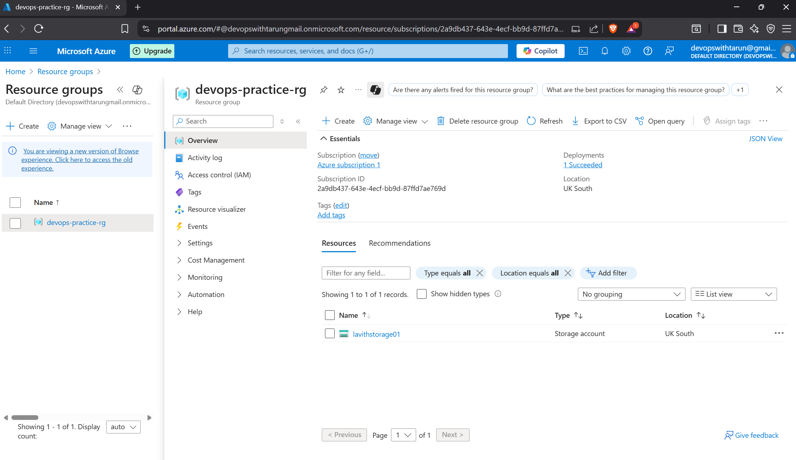
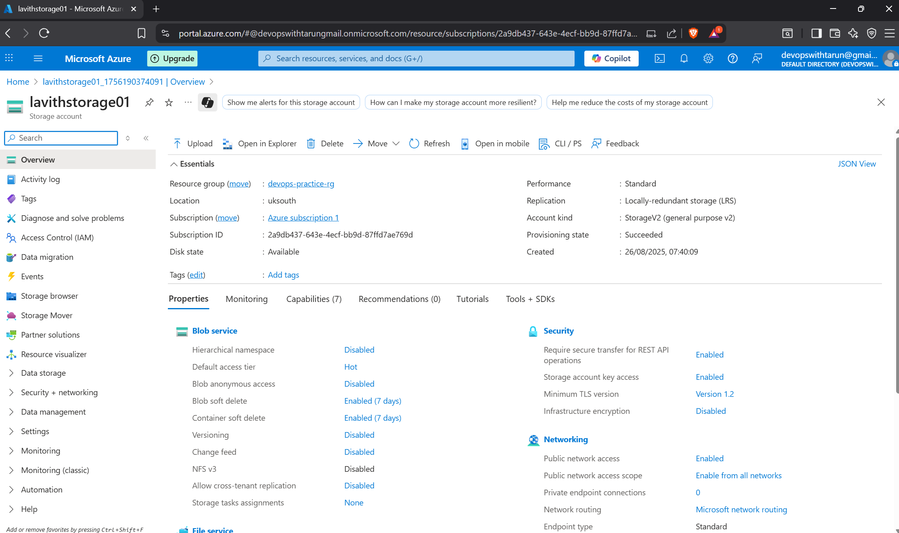
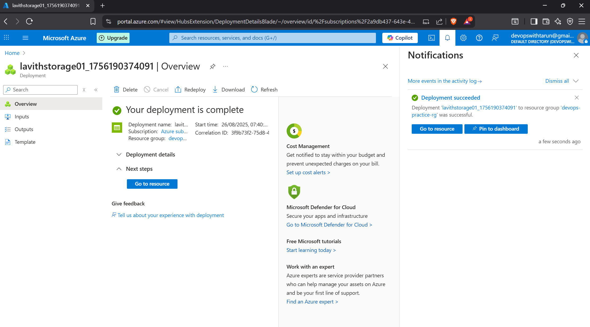

# Azure Storage Account Project

## Overview
Created an Azure Storage Account using the free tier to learn basic cloud deployment.

## Steps
1. Created a Resource Group `devops-practice-rg` in UK South.
2. Deployed a Storage Account `lavithstorage01` in the same region.
3. Verified the deployment.

## Skills Learned
- Azure portal navigation
- Creating resource groups and storage accounts
- Managing free-tier cloud resources

## Screenshots

# DevOps Portfolio - Tarun Kumar

Welcome to my DevOps Portfolio!  
This repo documents my journey as a Computer Science Engineer transitioning into DevOps, focusing on Azure, Terraform, CI/CD, and automation.

## Projects

1. [Azure Storage Account](./azure-storage/README.md) - Creating and managing Azure Storage Account (free-tier)
2. [Azure Virtual Machine](./azure-vm/README.md) - Deploying Linux VM on Azure
3. [Terraform Infrastructure](./terraform-iac/README.md) - Infrastructure as Code with Terraform
4. [CI/CD Pipeline](./cicd-pipeline/README.md) - Automated build & deployment pipeline

---

**Tech Stack:**  
- Azure Cloud  
- Terraform  
- Git & GitHub  
- Linux (WSL)  
- Docker & CI/CD (future)

---

Follow my journey: [LinkedIn]() | [Email](mailto:devopswithtarun@gmail.com)
