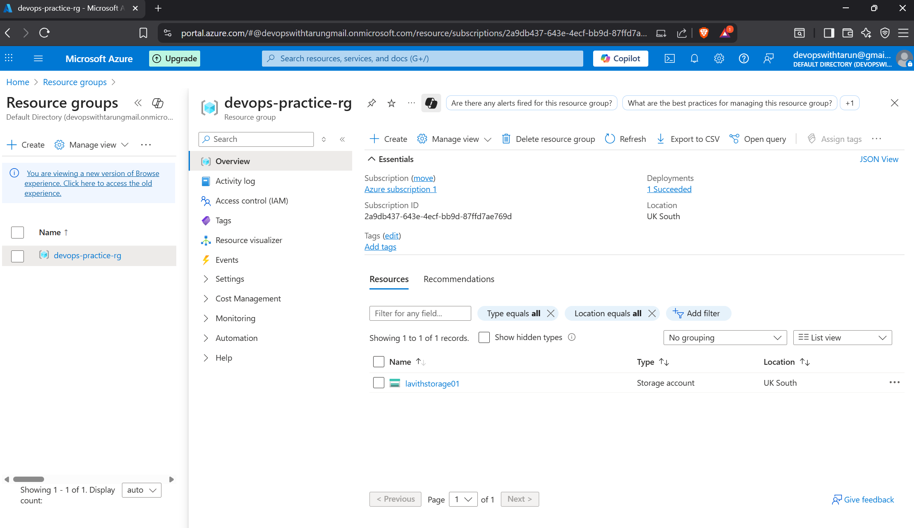
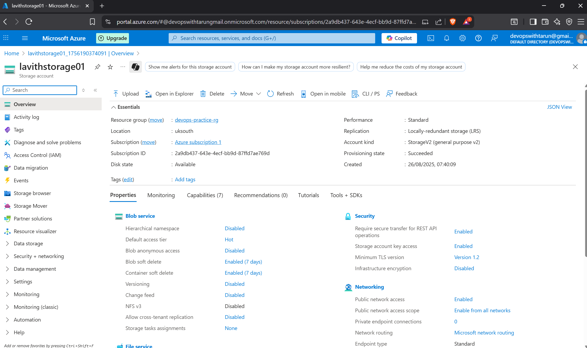

# Azure Storage Account Project

## Overview
Created an Azure Storage Account using the free tier to learn basic cloud deployment.

## Steps
1. Created a Resource Group `devops-practice-rg` in UK South.
2. Deployed a Storage Account `lavithstorage01` in the same region.
3. Verified the deployment.

## Skills Learned
- Azure portal navigation
- Creating resource groups and storage accounts
- Managing free-tier cloud resources

## Screenshots

