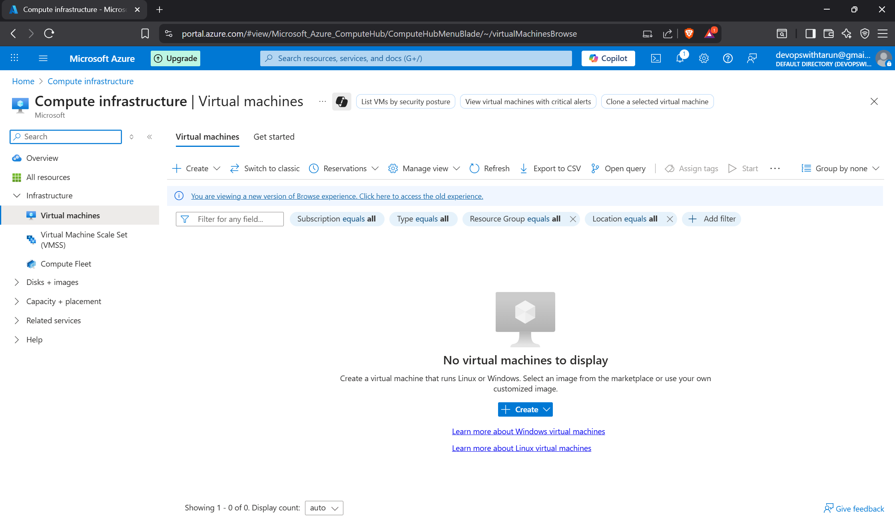
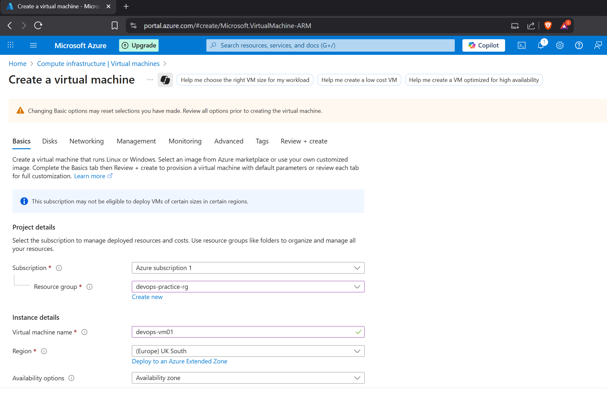
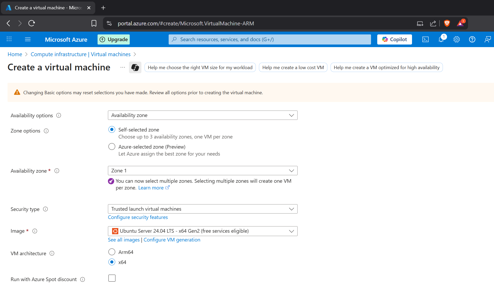
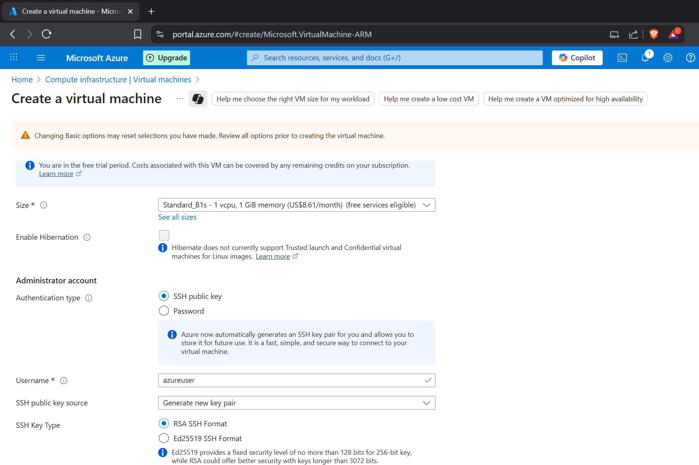
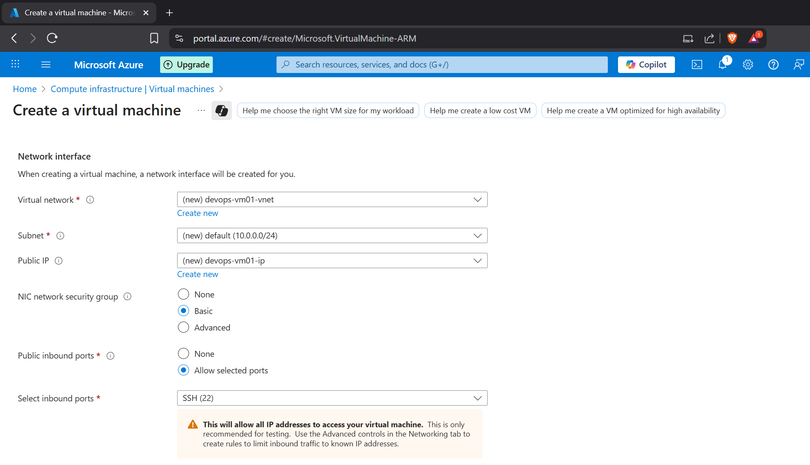
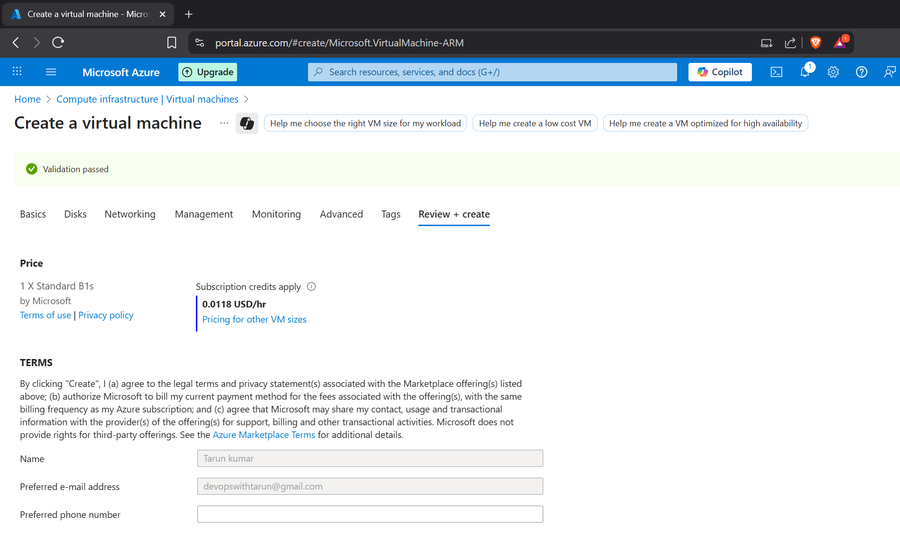
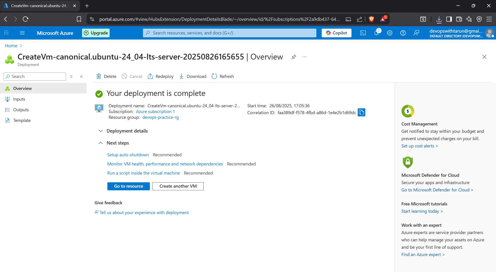

# Azure VM Project
## Overview
Provisioned a Linux VM on Azure and connected via SSH.

## Steps
1. Created resource group and Linux VM (Ubuntu 20.04 LTS).
2. Allowed SSH in NSG.
3. Connected from WSL using SSH.

## Screenshots

## Skills Learned
- VM provisioning on Azure
- SSH connectivity
- Basic Linux admin commands